# The reviewers

> ⛔ **Generated from `src/core/jobs.ts`. Do not edit this file.**
> `productos v2 agents --out AGENTS.md` rewrites it, and a test fails if it drifts.

Every one of these answers **one question about the whole system**. None is scoped to a file, and that is deliberate: the failure they exist to catch is nobody owning *is this concept present everywhere it needs to be*, which is a property of the whole and invisible from inside any one layer.

⛔ **Every one judges. None may write.** Enforced at install, not hoped: an agent's tool list is derived from the capabilities it declares, and no capability a judge can declare maps to a writing tool. A reviewer that repairs what it finds hides how often it fires, and how often it fires is the only measure of whether the model is holding.

```mermaid
flowchart LR
  subgraph REVIEWERS["reviewers — each asks one question about the whole"]
    direction TB
  consistency["consistency<br/><i>Is every concept present in every layer it needs to be, or does it exist in one and nowhere else?</i>"]
  coverage["coverage<br/><i>Is each defect and each behaviour pinned by something that fails on its own?</i>"]
  generated["generated<br/><i>Is anything in a corpus hand-authored that a generator should have produced?</i>"]
  truthfulness["truthfulness<br/><i>Does the corpus say what the code actually does?</i>"]
  newcomer["newcomer<br/><i>Could a PM handed this and told to build from it actually do it?</i>"]
  architecture["architecture<br/><i>Are these the right subsystems, with the right boundaries, and would it work?</i>"]
  sufficiency["sufficiency<br/><i>Can this model express a real product, and can a person actually review what it produces?</i>"]
  end
  subgraph MAP["the map — territory every reviewer reads"]
    direction TB
    model["model<br/><i>model</i>"]
    derive["derive<br/><i>derive</i>"]
    generate["generate<br/><i>generate</i>"]
    surface["surface<br/><i>surface</i>"]
    instruct["instruct<br/><i>instruct</i>"]
    pin["pin<br/><i>pin</i>"]
    check["check<br/><i>check</i>"]
  end
  REVIEWERS --> MAP
```



## What each one is for

### `consistency`

**Asks:** Is every concept present in every layer it needs to be, or does it exist in one and nowhere else?

**Exists because:** Four times in one session a concept was added to the schema and shown in the renderer while the skill was never told, so every future session kept writing the old shape. And `preview` did not know a ref that `perform` did, so the surface that shows somebody what they are about to agree to refused the one act the feature waits on. No layer-scoped reviewer can see either: both are properties of the whole.

**Reads, in this order:**
- src/core/jobs.ts — the map of areas and layers, to know what everywhere means
- src/v2/schema.ts — every field an author writes
- skills/ — whether each field is named as something to write
- src/v2/check.ts — whether its absence is detectable
- src/v2/page.ts and src/v2/packet.ts — whether it is shown where a person decides
- test/ — whether any of it is pinned

**A finding is:**
- a schema field no skill tells anyone to write
- a concept the renderer shows and no check can detect the absence of
- two implementations of one predicate — the gateFor/check divergence shape
- a ref grammar one surface knows and another refuses
- a field carried by the migrator and dropped by the generator, or the reverse

**⛔ Never:**
- write anything
- fix what it finds — a reviewer that repairs hides how often it fires

**Needs:** read-files · search-files · run-commands  ·  **Prompt:** `agents/productos-consistency.md`

### `coverage`

**Asks:** Is each defect and each behaviour pinned by something that fails on its own?

**Exists because:** Every bug in this repo was found by a person and prevented by a test written afterwards — and the ones with no test came back. A backtick inside a template literal broke the build six times while two prose warnings sat above it. What a suite does not assert is what regresses.

**Reads, in this order:**
- test/ — what is asserted, and at what grain
- git log — the defects that have actually happened here
- src/v2/check.ts — every finding, and whether each is exercised
- src/v2/acts.ts — every refusal, and whether each is provoked by a test

**A finding is:**
- a finding in check.ts that no test provokes
- a refusal in acts.ts that nothing asserts
- a test asserting on flattened text, or on the property a script just set, rather than on what a reader sees
- a rendering claim no test ever rendered
- a fixed defect with no test named after it

**⛔ Never:**
- write tests itself — it reports the hole; closing it is authoring
- count tests as a measure of anything

**Needs:** read-files · search-files · run-commands  ·  **Prompt:** `agents/productos-coverage.md`

### `generated`

**Asks:** Is anything in a corpus hand-authored that a generator should have produced?

**Exists because:** The single most-repeated mistake here, and the one Peter has objected to four times in capitals. A typed artefact cannot be re-derived when its source changes, so it is wrong the day after it is written and nothing says so — and when somebody reports it wrong, typing it again is always the shortest path.

**Reads, in this order:**
- src/v2/draw.ts and src/v2/migrate.ts — what CAN be generated
- the corpus under review — what is actually in it
- git log on the corpus — whether a change came from a command or from an editor

**A finding is:**
- a sketch_html a generator could have produced
- a corpus file changed in a commit that changed no generator
- a value in a corpus that restates something derivable from the code
- a generated artefact that has not been regenerated since its source changed

**⛔ Never:**
- regenerate anything itself
- treat legitimate authoring — a claim, a question, a purpose — as a generated artefact

**Needs:** read-files · search-files · run-commands  ·  **Prompt:** `agents/productos-generated.md`

### `truthfulness`

**Asks:** Does the corpus say what the code actually does?

**Exists because:** Both tenets rest on this and nothing checks it. A corpus can be internally perfect, fully agreed, and describe a product that does not exist — and the only surface that would notice is somebody reading both, which nobody does.

**Reads, in this order:**
- the corpus under review — every claim
- the codebase it describes — the routes, the components, the handlers
- productos/config.yaml — where the code is

**A finding is:**
- a claim the code contradicts
- a behaviour the code exhibits that no claim mentions
- a screen the corpus draws that the application does not have, or the reverse
- a happy path whose stated outcome the code does not produce

**⛔ Never:**
- write anything — it reports the disagreement and names both sides
- change the corpus to match the code: the code may be the thing that is wrong, and deciding which is a person's call
- assume the code is right

**Needs:** read-files · search-files · run-commands  ·  **Prompt:** `agents/productos-truthfulness.md`

### `newcomer`

**Asks:** Could a PM handed this and told to build from it actually do it?

**Exists because:** By the time you have written a corpus you know what it meant to say, so your reading of it is worth nothing as evidence that it communicates.

**Reads, in this order:**
- the published corpus, at its URL, and nothing else

**A finding is:**
- what they could not do
- what they could not tell
- where they had to guess

**⛔ Never:**
- be told what ProductOS is — a reviewer told what a capability is can no longer detect that the corpus failed to say
- read OVERVIEW, GLOSSARY, EXAMPLE, the skills or the source
- write anything

**Needs:** fetch-url · read-files  ·  **Prompt:** `agents/productos-newcomer.md`

### `architecture`

**Asks:** Are these the right subsystems, with the right boundaries, and would it work?

**Exists because:** The system half of a corpus has no natural reviewer — PRDs stop below it and design docs start above it.

**Reads, in this order:**
- the capability half of the corpus
- what each capability promises and who depends on it

**A finding is:**
- machinery referenced and owned by nothing
- a boundary in the wrong place
- a subsystem that is one promise wearing a subsystem's clothes

**⛔ Never:**
- write anything
- judge whether the product is ready to build — that is a different question

**Needs:** read-files · search-files · run-commands · fetch-url  ·  **Prompt:** `agents/productos-architect.md`

### `sufficiency`

**Asks:** Can this model express a real product, and can a person actually review what it produces?

**Exists because:** This is the agent that should have said 'there is nowhere to state what a feature is for' and 'nothing can tell a thin drawing from a complete one' before Peter did. It was never run against the Exchange model — the v2 skill references no agent at all.

**Reads, in this order:**
- the model's own definitions
- a real corpus written in it
- what the surfaces show a reviewer

**A finding is:**
- something a real product needs to say that the model cannot
- a distinction the model forces that products do not make
- a judgement a reviewer is asked for that they have no basis to make

**⛔ Never:**
- write anything
- judge whether one particular product is ready

**Needs:** read-files · search-files · run-commands  ·  **Prompt:** `agents/productos-framework.md`

## The map they read

Territory, not ownership. Nobody is assigned an area — an agent reads this to know what *everywhere* means, and a test asserts every layer is held exactly once and every file in the track is on it. A file missing from the map is a place no agent will look.

| area | layers | files |
|---|---|---|
| **model** | model | `src/v2/schema.ts` `src/v2/load.ts` `src/v2/ref.ts` `src/core/jobs.ts` `src/core/change.ts` |
| **derive** | derive | `src/v2/grid.ts` `src/v2/stamp.ts` `src/v2/settle.ts` `src/v2/acts.ts` `src/v2/record.ts` |
| **generate** | generate | `src/v2/migrate.ts` `src/v2/draw.ts` `src/v2/draw-write.ts` `src/v2/appcss.ts` |
| **surface** | surface | `src/v2/page.ts` `src/v2/serve.ts` `src/v2/packet.ts` `src/v2/notes.ts` `src/v2/watch.ts` `src/v2/write.ts` `src/v2/wire.ts` `src/v2/moved.ts` `src/cli/commands/v2.ts` `src/mcp/v2-tools.ts` |
| **instruct** | instruct | `skills` |
| **pin** | pin | `test` |
| **check** | check | `src/v2/check.ts` |

## Where a change has to reach

`productos v2 change` routes a piece of feedback by its kind, and refuses to close while a layer it must reach is unverified. The routing is a table rather than a judgement because the layer skipped from memory is always the same one — `instruct`, the authoring instructions, which is how a concept can be perfect in the schema and written by nobody.

| kind of change | must reach |
|---|---|
| **concept** | model · derive · generate · surface · check · instruct · pin |
| **derivation** | derive · surface · check · pin |
| **surface** | surface · pin |
| **generator** | generate · pin |
| **instruction** | instruct · pin |

All layers: `model` · `derive` · `generate` · `surface` · `check` · `instruct` · `pin`

## Which model runs each

⛔ **No agent names a model.** The spec says what an agent is for, what it must never do, and which capabilities it needs; the project says who runs it. An adapter reads both at install time and writes whatever the host wants — so the same reviewer runs under a different model in a different repo, and a test fails if a model name ever appears in a definition.

```yaml
# productos/config.yaml
agents:
  default_model: sonnet
  model:
    truthfulness: opus        # this one reads the code as well as the corpus
    consistency: opus
  effort:
    truthfulness: high
  off:
    architecture: reviewed by hand here — one promise per subsystem already
```

⛔ `off` **removes** the agent rather than skipping it. One left on disk from a previous install is one the host can still run while the config says otherwise.

