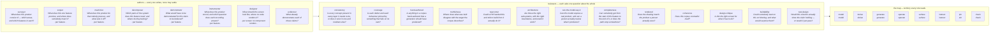
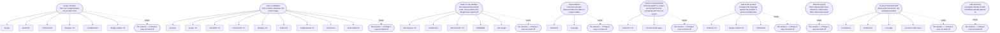

# The roles

> ⛔ **Generated from `src/core/jobs.ts`. Do not edit this file.**
> `productos v2 agents --out AGENTS.md` rewrites it, and a test fails if it drifts.

Two registries and one routing table. **Authors** write a corpus; **reviewers** judge one. Every role answers a single question, and none is scoped to a file — the failure they exist to catch is nobody owning *is this concept present everywhere it needs to be*, which is a property of the whole and invisible from inside any one layer.

⛔ **Every reviewer judges and none may write. Every author writes and none may settle.** Two interfaces, each with a required literal, so neither list can quietly acquire a member of the other kind — and an agent's tools are derived from the capabilities it declares, so a judge cannot be handed a writing tool and an author cannot be handed a question.

The two halves exist for the same reason, from opposite directions. A reviewer that repairs what it finds hides how often it fires, and how often it fires is the only measure of whether the model is holding. An author that settles what it wrote produces a corpus where every question is answered and none of the answers is anybody's.


```mermaid
flowchart LR
  subgraph AUTHORS_G["authors — every one writes, none may settle"]
    direction TB
    surveyor["surveyor<br/><i>What does this product consist of — which areas, and which features in each?</i>"]
    scoper["scoper<br/><i>What does this one feature promise, and where does somebody meet it?</i><br/>· per feature ·"]
    machinist["machinist<br/><i>What does this product do that nobody presses, and what sets it off?</i><br/>· per feature ·"]
    decomposer["decomposer<br/><i>Which parts of the system does this feature need, and where do they belong?</i><br/>· per feature ·"]
    demonstrator["demonstrator<br/><i>What would have to be demonstrated for this claim to be believed?</i><br/>· per feature ·"]
    instrumenter["instrumenter<br/><i>What does this product record, and which question does each recording answer?</i><br/>· per feature ·"]
    designer["designer<br/><i>What should this screen look like, where no code renders it?</i><br/>· per screen no component renders ·"]
    evidencer["evidencer<br/><i>What already demonstrates each of these claims?</i>"]
  end
  subgraph REVIEWERS["reviewers — each asks one question about the whole"]
    direction TB
  consistency["consistency<br/><i>Is every concept present in every layer it needs to be, or does it exist in one and nowhere else?</i>"]
  coverage["coverage<br/><i>Is each defect and each behaviour pinned by something that fails on its own?</i>"]
  hand_authored["hand-authored<br/><i>Is anything in a corpus hand-authored that a generator should have produced?</i>"]
  truthfulness["truthfulness<br/><i>Where does what was built disagree with the target the corpus describes?</i>"]
  newcomer["newcomer<br/><i>Could a PM handed this and told to build from it actually do it?</i>"]
  architecture["architecture<br/><i>Are these the right subsystems, with the right boundaries, and would it work?</i>"]
  can_the_model_say_it["can-the-model-say-it<br/><i>Can this model express a real product, and can a person actually review what it produces?</i>"]
  completeness["completeness<br/><i>Can somebody get from the start of this feature to the end of it, or does the path stop somewhere?</i>"]
  rendered["rendered<br/><i>Does the drawing match the product a person actually sees?</i>"]
  coherence["coherence<br/><i>Does this corpus contradict itself?</i>"]
  design_critique["design-critique<br/><i>Is this the right screen for what it has to do?</i>"]
  buildability["buildability<br/><i>Could somebody start on this on Monday, and what would surprise them?</i>"]
  test_design["test-design<br/><i>Would this criterion actually show the claim holding — or would it just pass?</i>"]
  end
  subgraph MAP["the map — territory every role reads"]
    direction TB
    model["model<br/><i>model</i>"]
    derive["derive<br/><i>derive</i>"]
    generate["generate<br/><i>generate</i>"]
    operate["operate<br/><i>operate</i>"]
    surface["surface<br/><i>surface</i>"]
    instruct["instruct<br/><i>instruct</i>"]
    pin["pin<br/><i>pin</i>"]
    check["check<br/><i>check</i>"]
  end
  AUTHORS_G --> REVIEWERS
  REVIEWERS --> MAP
```

## The team

⛔ **Described by who would have done the work, not by what they are allowed to touch.** Nothing is gated on a discipline and it is not a hierarchy. What it buys is being able to look at this list and see a team with holes in it — which is how four of the roles below were found. Reading the roles one at a time, each was clearly necessary and nothing said what was absent.

⛔ **"The framework itself" is a real seat.** Those roles review ProductOS, not anybody's product. The distinction is not cosmetic: `consistency` asks whether a concept reached every layer of *the framework* and reads only our source, while `coherence` asks whether a *corpus* contradicts itself. Both questions are worth asking and neither reviewer can answer the other's — which is why the second one was added rather than the first relabelled.

| seat | roles |
|---|---|
| **product** | `surveyor` ·writes· · `scoper` ·writes· · `newcomer` · `completeness` · `coherence` |
| **design** | `designer` ·writes· · `rendered` · `design-critique` |
| **engineering** | `machinist` ·writes· · `decomposer` ·writes· · `instrumenter` ·writes· · `truthfulness` · `architecture` · `buildability` |
| **quality** | `demonstrator` ·writes· · `evidencer` ·writes· · `coverage` · `hand-authored` · `test-design` |
| **the framework itself** | `consistency` · `can-the-model-say-it` |


## The tree — which roles each skill orchestrates

⛔ **The orchestrator is the session, and it cannot be a subagent.** It is the only thing talking to the person, and talking to the person is the one job that may never be delegated. So what is modelled here is not an orchestrating agent — it is the **routing**, declared, so a session reads a table instead of deciding from memory which roles a request needs.

Same reason `CASCADE` is a table: a routing decided from memory is decided differently every time, and the step that gets skipped is always the one nobody is watching. Here that step is `keeps`. Spawning four agents and forgetting somebody still has to **agree** is exactly how a corpus ends up fully written, fully checked, and validated by nobody.


```mermaid
flowchart TD
  scope_a_feature(["scope a feature<br/><i>Turn one in-flight feature into product truth</i>"])
  scope_a_feature --> scope_a_feature_scoper["scoper"]
  scope_a_feature --> scope_a_feature_machinist["machinist"]
  scope_a_feature --> scope_a_feature_instrumenter["instrumenter"]
  scope_a_feature --> scope_a_feature_designer["designer ×N"]
  scope_a_feature --> scope_a_feature_completeness["completeness"]
  scope_a_feature --> scope_a_feature_design-critique["design-critique ×N"]
  scope_a_feature -.->|keeps| scope_a_feature_self(["the session — 4 things it may not hand off"])
  scan_a_codebase(["scan a codebase<br/><i>Turn a whole codebase into a first corpus</i>"])
  scan_a_codebase --> scan_a_codebase_surveyor["surveyor"]
  scan_a_codebase --> scan_a_codebase_scoper["scoper ×N"]
  scan_a_codebase --> scan_a_codebase_machinist["machinist ×N"]
  scan_a_codebase --> scan_a_codebase_instrumenter["instrumenter ×N"]
  scan_a_codebase --> scan_a_codebase_designer["designer ×N"]
  scan_a_codebase --> scan_a_codebase_evidencer["evidencer"]
  scan_a_codebase --> scan_a_codebase_completeness["completeness ×N"]
  scan_a_codebase --> scan_a_codebase_coherence["coherence"]
  scan_a_codebase --> scan_a_codebase_hand-authored["hand-authored"]
  scan_a_codebase -.->|keeps| scan_a_codebase_self(["the session — 4 things it may not hand off"])
  hand_it_to_the_builders(["hand it to the builders<br/><i>The engineering and QA read, once product and design have signed off</i>"])
  hand_it_to_the_builders --> hand_it_to_the_builders_decomposer["decomposer ×N"]
  hand_it_to_the_builders --> hand_it_to_the_builders_architecture["architecture"]
  hand_it_to_the_builders --> hand_it_to_the_builders_demonstrator["demonstrator ×N"]
  hand_it_to_the_builders --> hand_it_to_the_builders_buildability["buildability"]
  hand_it_to_the_builders --> hand_it_to_the_builders_test-design["test-design"]
  hand_it_to_the_builders -.->|keeps| hand_it_to_the_builders_self(["the session — 3 things it may not hand off"])
  map_evidence(["map evidence<br/><i>Find what already demonstrates the claims a corpus makes</i>"])
  map_evidence --> map_evidence_evidencer["evidencer"]
  map_evidence --> map_evidence_coverage["coverage"]
  map_evidence -.->|keeps| map_evidence_self(["the session — 3 things it may not hand off"])
  check_it_communicates(["check it communicates<br/><i>Find out whether a corpus can be built from by somebody who has not read it</i>"])
  check_it_communicates --> check_it_communicates_newcomer["newcomer ×N"]
  check_it_communicates --> check_it_communicates_can-the-model-say-it["can-the-model-say-it"]
  check_it_communicates -.->|keeps| check_it_communicates_self(["the session — 3 things it may not hand off"])
  look_at_the_product(["look at the product<br/><i>Compare the drawings against the product a person actually sees</i>"])
  look_at_the_product --> look_at_the_product_rendered["rendered ×N"]
  look_at_the_product --> look_at_the_product_design-critique["design-critique ×N"]
  look_at_the_product --> look_at_the_product_truthfulness["truthfulness"]
  look_at_the_product -.->|keeps| look_at_the_product_self(["the session — 3 things it may not hand off"])
  drain_the_queue(["drain the queue<br/><i>Work what people have asked for, and answer them where they asked</i>"])
  drain_the_queue -.->|keeps| drain_the_queue_self(["the session — 3 things it may not hand off"])
  review_ProductOS_itself(["review ProductOS itself<br/><i>Review the framework, not anybody's product</i>"])
  review_ProductOS_itself --> review_ProductOS_itself_consistency["consistency"]
  review_ProductOS_itself --> review_ProductOS_itself_architecture["architecture"]
  review_ProductOS_itself --> review_ProductOS_itself_coverage["coverage"]
  review_ProductOS_itself --> review_ProductOS_itself_can-the-model-say-it["can-the-model-say-it"]
  review_ProductOS_itself -.->|keeps| review_ProductOS_itself_self(["the session — 3 things it may not hand off"])
  edit_one_thing(["edit one thing<br/><i>A surgical change to truth somebody already agreed to</i>"])
  edit_one_thing -.->|keeps| edit_one_thing_self(["the session — 1 thing it may not hand off"])
```


### scope a feature

Turn one in-flight feature into product truth.

⛔ **Runs at stage: specification** — derived by stageOf, never stored.

**Spawns, in order:**
- `scoper` *(product · writes)* — the feature written in a context holding nothing but that feature
- `machinist` *(engineering · writes)* — the half of this feature nobody presses — what runs by itself, and what sets it off
- `instrumenter` *(engineering · writes)* — what has to be recorded for any of this feature's measures to be knowable
- `designer` *(design · writes)* — one per unit, in parallel — screens the product should have and nothing renders yet
- `completeness` *(product · judges, writes nothing)* — whether somebody can get from the start of this feature to the end of it
- `design-critique` *(design · judges, writes nothing)* — one per unit, in parallel — whether these are the right screens for the job, not just complete ones

**⛔ Keeps, because it may not be delegated:**
- the conversation about what this feature is for — a purpose inferred from code is a purpose nobody chose
- putting every open question to the person, in their own interface
- every act of judgement, and never answering one on their behalf
- ⛔ stopping here. The engineering and QA reads are a different route and it cannot run until somebody has agreed to this — an engineer costing a draft produces a decision nobody made

### scan a codebase

Turn a whole codebase into a first corpus.

**Spawns, in order:**
- `surveyor` *(product · writes)* — decide what the product consists of once, before anything describes a feature
- `scoper` *(product · writes)* — one per unit, in parallel — every feature written in its own context, reading only its own code
- `machinist` *(engineering · writes)* — one per unit, in parallel — every feature's machinery, written by somebody whose question is what runs without a person
- `instrumenter` *(engineering · writes)* — one per unit, in parallel — what the product already records, and which measure each recording answers
- `designer` *(design · writes)* — one per unit, in parallel — a picture for every screen no component renders — a screen with none cannot be reviewed
- `evidencer` *(quality · writes)* — what the repository already demonstrates, found by somebody who did not write the claims
- `completeness` *(product · judges, writes nothing)* — one per unit, in parallel — every feature walked end to end, because a first corpus is where paths fail to join
- `coherence` *(product · judges, writes nothing)* — ⛔ the whole corpus at once — thirty scopers writing in isolation is exactly how one word comes to mean two things
- `hand-authored` *(quality · judges, writes nothing)* — whether anything was typed that a generator should have produced — on a run this large, nobody would notice

**⛔ Keeps, because it may not be delegated:**
- running `productos v2 generate`, because a screen a component renders is DRAWN and never designed — it sweeps BOTH corpus layouts and copies the design libraries in first, so a drawing looks like the product wherever the corpus is read rather than only beside a checkout
- running `productos v2 check` before anybody is asked to look
- putting the survey in front of a person before thirty scopers start against a partition that is wrong
- every act of judgement — nothing here is validated by having been written

### hand it to the builders

The engineering and QA read, once product and design have signed off.

⛔ **Runs at stage: ready for review** — derived by stageOf, never stored.

**Spawns, in order:**
- `decomposer` *(engineering · writes)* — one per unit, in parallel — which parts of the system this needs, now that the promise it answers is agreed
- `architecture` *(engineering · judges, writes nothing)* — whether those are the right subsystems, with boundaries that hold
- `demonstrator` *(quality · writes)* — one per unit, in parallel — what would have to be demonstrated for each agreed claim to be believed
- `buildability` *(engineering · judges, writes nothing)* — whether somebody could start on Monday — the second tenet, read from a builder's seat
- `test-design` *(quality · judges, writes nothing)* — whether each criterion would show its claim holding, rather than merely pass

**⛔ Keeps, because it may not be delegated:**
- ⛔ checking somebody actually agreed before spawning either of these — the precondition is the whole point of the split
- deciding what to do with what comes back: a question the corpus must settle goes to the person, never to the builder
- every act of judgement — an engineer saying it is buildable is not somebody agreeing it is right

### map evidence

Find what already demonstrates the claims a corpus makes.

**Spawns, in order:**
- `evidencer` *(quality · writes)* — the whole of the search, by a role that cannot mistake a green test for agreement
- `coverage` *(quality · judges, writes nothing)* — whether each claim is pinned by something that fails on its own

**⛔ Keeps, because it may not be delegated:**
- the decision about what to do with a criterion nothing demonstrates
- ⛔ not reading a coverage number as quality — whether those criteria would show anything is `ready it for build`, after somebody has agreed
- never letting coverage be reported as validation

### check it communicates

Find out whether a corpus can be built from by somebody who has not read it.

**Spawns, in order:**
- `newcomer` *(product · judges, writes nothing)* — one per unit, in parallel — a product manager handed a URL, who has never seen ProductOS and may not read its source
- `can-the-model-say-it` *(the framework itself · judges, writes nothing)* — whether a confusion is the corpus's fault or ours — the routing this whole route exists to get right

**⛔ Keeps, because it may not be delegated:**
- running the reviewers, which judge and never write
- routing what comes back: a framework gap to us, a corpus finding to the author
- never answering a newcomer's confusion — writing it down is the output

### look at the product

Compare the drawings against the product a person actually sees.

**Spawns, in order:**
- `rendered` *(design · judges, writes nothing)* — one per unit, in parallel — whether the drawing matches the product a person actually sees
- `design-critique` *(design · judges, writes nothing)* — one per unit, in parallel — ⛔ and whether it is any good — `rendered` refuses this, so a faithful drawing of a bad screen passes it
- `truthfulness` *(engineering · judges, writes nothing)* — where the built product disagrees with the target, reported as drift and never as the corpus being wrong

**⛔ Keeps, because it may not be delegated:**
- bringing the environment up, and saying so when it will not come up
- running the reviewer that looks, which judges and never writes
- never treating a difference as the corpus being wrong — the corpus is the target state

### drain the queue

Work what people have asked for, and answer them where they asked.

**Spawns nothing.** Every part of this is something the session may not hand off.

**⛔ Keeps, because it may not be delegated:**
- deciding which route each request belongs to, and running it
- replying where they asked — ⛔ a `pos:` is answered concisely, and the framework is what changes
- every act of judgement

### review ProductOS itself

Review the framework, not anybody's product.

**Spawns, in order:**
- `consistency` *(the framework itself · judges, writes nothing)* — whether a concept reached every layer, or stopped at the one that was convenient
- `architecture` *(engineering · judges, writes nothing)* — whether these are the right subsystems with the right boundaries, and whether it would work
- `coverage` *(quality · judges, writes nothing)* — whether each defect we fixed is pinned by something that fails on its own
- `can-the-model-say-it` *(the framework itself · judges, writes nothing)* — whether the model can express a real product, and whether a person can review what it produces

**⛔ Keeps, because it may not be delegated:**
- ⛔ deciding what to change — these four judge the framework and may not touch it
- running it after a change to `src/` or `skills/`, which is when a layer gets skipped
- recording what came back with `productos v2 change`, in the words it came back in

### edit one thing

A surgical change to truth somebody already agreed to.

**Spawns nothing.** Every part of this is something the session may not hand off.

**⛔ Keeps, because it may not be delegated:**
- the edit itself — one field is not worth a context, and a scoper would rewrite around it

## The authors

⛔ **Every one writes. None may settle.** The exact mirror of the reviewers' rule, and it is what makes this a model rather than a refactor. An author may propose, populate, draw and regenerate. It may never produce a verdict, answer an open question, or mark anything walked or validated — because a subagent that obtains consent is a consent path with no record of how consent was obtained, which is the whole thing `Verdict.via` exists to prevent.

Held three ways rather than one: no author declares `ask-the-human`, so no host hands one a question tool and the install refuses an author that asks for it; what an author cannot resolve becomes a `question:` with no claim, which is writing something down and therefore allowed; and anything an author does record carries `via: agent`, which never counts as somebody having agreed.

**Skills are the shims.** A skill keeps the orchestration and the conversation with the person — which is the part that may not be delegated — and spawns these for the reading and the writing. The `per` column is what tells a skill whether to spawn one or thirty.

| author | asks | per | writes |
|---|---|---|---|
| **surveyor** | What does this product consist of — which areas, and which features in each? | runs once | the areas, as scopes; each feature as a scope inside its area, with a title and nothing else |
| **scoper** | What does this one feature promise, and where does somebody meet it? | feature | the happy path — what the feature is FOR, first; views and their parts; person-asked exchanges, and what each slot says; criteria — what would show a sentence holding; `why`, `risks` and `measures` — why this is worth building, what could go wrong, and how anybody would know it worked; `terms` — what each word means in this feature; `question:` on anything it cannot resolve, with no claim beside it |
| **machinist** | What does this product do that nobody presses, and what sets it off? | feature | system- and integrator-asked exchanges, and what each slot says; `when.triggered_by` — what sets it off, in product language; `when.follows` — the ask this one comes after, where something in the product sets it off; `depends_on` — what this rests on and does not itself behaviour; `question:` on anything it cannot resolve, with no claim beside it |
| **decomposer** | Which parts of the system does this feature need, and where do they belong? | feature | subsystems — roughly what each does, and which area it is filed inside; `offers` — the capabilities a subsystem provides, each in a sentence; `serves` — the product statement each capability exists for, or the capability that needs it; `uses` — what a subsystem leans on across the tree, where containment cannot say it |
| **demonstrator** | What would have to be demonstrated for this claim to be believed? | feature | criteria — what must be demonstrated for each claim, as given/when/then; `derived` — the role, the date, and the hash of the claim it was worked out against; `of` — which statement, wherever the slot says more than one thing; `level` — where somebody would have to stand to observe it, where that is knowable from the claim |
| **instrumenter** | What does this product record, and which question does each recording answer? | feature | instruments — what gets recorded, in the product's own terms; `feeds` — which measure each recording answers, which is what stops either end being decorative |
| **designer** | What should this screen look like, where no code renders it? | screen no component renders | a drawing for a screen no component renders, stamped with what it was designed from |
| **evidencer** | What already demonstrates each of these claims? | runs once | evidence against criteria, each naming what it is and where it came from |

### `surveyor`

**Asks:** What does this product consist of — which areas, and which features in each?

**Exists because:** The first thing anybody does with a codebase is the thing least suited to being done feature by feature: deciding what the features ARE. Done inside a per-feature pass it is decided thirty times, differently, by whoever happens to be reading that file — which is how a whole product came to be filed as a single area and ten capabilities came out as a flat list of operations with no subsystem named anywhere.

**Spawned:** once

**Reads, in this order:**
- the codebase's routes and top-level directories — where the product divides itself
- productos/config.yaml — what has already been said about where things live
- any existing corpus, so a second run extends rather than re-partitions

**Writes:**
- the areas, as scopes
- each feature as a scope inside its area, with a title and nothing else

**⛔ Never:**
- write what a feature promises — naming it and describing it are different jobs, and doing both in one pass is how a survey becomes thirty shallow scopes nobody can review
- re-partition an area that already exists because a new reading of the code suggests a different cut — say so instead, and let somebody decide
- file a whole product as one area, which is the failure this role exists to stop

**Needs:** read-files · search-files · run-commands · write-corpus  ·  **Prompt:** `agents/productos-surveyor.md`

### `scoper`

**Asks:** What does this one feature promise, and where does somebody meet it?

**Exists because:** This is the role the whole idea is for: the only part of authoring that genuinely parallelises, and the part a single session does worst because by feature nine it is writing the shape it wrote for feature eight. Thirty features is thirty contexts, each reading only its own code.

**Spawned:** once per feature

**Reads, in this order:**
- its own scope, and nothing about any other feature
- the code that implements it, where code exists
- GLOSSARY.md and the skill — what the eight slots are, and what belongs in each

**Writes:**
- the happy path — what the feature is FOR, first
- views and their parts
- person-asked exchanges, and what each slot says
- criteria — what would show a sentence holding
- `why`, `risks` and `measures` — why this is worth building, what could go wrong, and how anybody would know it worked
- `terms` — what each word means in this feature
- `question:` on anything it cannot resolve, with no claim beside it

**⛔ Never:**
- answer a question it raised — an author that resolves its own ambiguity has recorded a decision nobody made
- read another feature's scope to stay consistent with it: consistency across scopes is a reviewer's question, and an author reaching for it produces thirty copies of one guess
- write a screen's picture — that is generated, and typing one is the defect this project has repeated most
- stamp anything walked, validated or accepted

**Needs:** read-files · search-files · run-commands · write-corpus  ·  **Prompt:** `agents/productos-scoper.md`

### `machinist`

**Asks:** What does this product do that nobody presses, and what sets it off?

**Exists because:** Measured on this repo: `integrator` appeared in no authoring prompt at all, and `triggered_by` — required on every machinery ask — appeared once. A builder cannot tell a nightly job from a backfill from something another part of the product calls, and those are three different programs.

**Spawned:** once per feature

**Reads, in this order:**
- its own scope's machinery, and the code that runs it
- what the product already calls these things — a trigger is named in product language, never as a schedule expression
- what the scope rests on, so `depends_on` is the real list rather than the obvious one

**Writes:**
- system- and integrator-asked exchanges, and what each slot says
- `when.triggered_by` — what sets it off, in product language
- `when.follows` — the ask this one comes after, where something in the product sets it off
- `depends_on` — what this rests on and does not itself behaviour
- `question:` on anything it cannot resolve, with no claim beside it

**⛔ Never:**
- write a person-asked exchange — that is the scoper's, and a machinery author reaching for one produces a screen nobody designed
- name infrastructure: a queue, a cron expression, a table or a topic is how it is built, not what the product does
- invent a trigger from the code's scheduling — if nothing says what sets it off, that is a `question:`, because a guessed trigger reads exactly like a decided one
- stamp anything walked, validated or accepted

**Needs:** read-files · search-files · run-commands · write-corpus  ·  **Prompt:** `agents/productos-machinist.md`

### `decomposer`

**Asks:** Which parts of the system does this feature need, and where do they belong?

**Exists because:** The capability tree was deleted from the model by a session nobody asked, and the only trace was a comment calling it deleted. `architecture` went on being dispatched against *"the subsystems beneath them"* and finding none — a judge reviewing half a site that did not exist, which is how a whole layer goes missing with every check green.

**Spawned:** once per feature

**Reads, in this order:**
- what this feature promises, which is what the machinery is required to answer
- the subsystems that already exist, because a new part for work an existing one does is the most expensive thing this role can produce
- the code where there is code, to name the parts that are really there rather than the ones a diagram would have

**Writes:**
- subsystems — roughly what each does, and which area it is filed inside
- `offers` — the capabilities a subsystem provides, each in a sentence
- `serves` — the product statement each capability exists for, or the capability that needs it
- `uses` — what a subsystem leans on across the tree, where containment cannot say it

**⛔ Never:**
- write or reword product truth — a capability answers a promise and never changes one. ⛔ A decomposition that needed the promise to be different is a note, not an edit
- invent a capability nothing serves: if no statement requires it, say so rather than filing it, because a part nobody asked for is indistinguishable from layering one level up
- name infrastructure — a queue, a table, a topic or a framework is how a part is built, not what it is
- write a given/when/then here: precision about behaviour belongs to product truth, and this layer is a sketch of the parts
- stamp anything walked, validated or accepted. ⛔ Capabilities become agreeable by engineers later; nothing agrees to one today

**Needs:** read-files · search-files · run-commands · write-corpus  ·  **Prompt:** `agents/productos-decomposer.md`

### `demonstrator`

**Asks:** What would have to be demonstrated for this claim to be believed?

**Exists because:** A criterion was authored, by the scoper, as a side-effect of scoping — so the artefact a builder implements was produced by the role least equipped to design it. `test-design` has asked whether each one would show its claim holding since before anything could act on the answer, because naming the defect is its only output. A judge with no author is how the whole layer stayed as thin as whoever happened to be describing the feature.

**Spawned:** once per feature

**Reads, in this order:**
- the claim, as agreed — ⛔ never a draft, because working out the tests for a sentence nobody has accepted means doing it twice
- what the claim refuses and what it fails at, because those are the cases a happy-path demonstration never reaches
- what the slot says statement by statement, where it says several things, so each one is demonstrated rather than the first
- the rules resolved into the slot, because a requirement has to hold under them and not only under the local sentence

**Writes:**
- criteria — what must be demonstrated for each claim, as given/when/then
- `derived` — the role, the date, and the hash of the claim it was worked out against
- `of` — which statement, wherever the slot says more than one thing
- `level` — where somebody would have to stand to observe it, where that is knowable from the claim

**⛔ Never:**
- write or reword a claim. ⛔ A requirement that needs the sentence to be different is a note addressed to whoever owns the sentence — changing it would be the test deciding the product
- assert anything the claim does not say: an engineer implements the `then`, so a word invented here becomes product truth nobody agreed to
- demonstrate a claim about refusing with a case that succeeds — the whole content of the claim is in the part a happy path never reaches
- work anything out from a claim nobody has accepted yet
- stamp anything walked, validated or accepted

**Needs:** read-files · search-files · run-commands · write-corpus  ·  **Prompt:** `agents/productos-demonstrator.md`

### `instrumenter`

**Asks:** What does this product record, and which question does each recording answer?

**Exists because:** `Instrument.feeds` is the load-bearing field of a pair the schema already warns about — a measure nothing feeds cannot be known, and an instrument feeding nothing is telemetry somebody maintains for nobody. Both were named once across every authoring prompt, so both ends of the link were written by nobody.

**Spawned:** once per feature

**Reads, in this order:**
- the measures on this scope — what somebody decided would show it worked
- what the product already records, in the code that records it

**Writes:**
- instruments — what gets recorded, in the product's own terms
- `feeds` — which measure each recording answers, which is what stops either end being decorative

**⛔ Never:**
- write a measure — what counts as having worked is product's call, and an instrument that invents its own measure is a number marking its own homework
- name a column, a table or an event schema — the schema asks for product terms, and a field name here is a leak of the substrate
- stamp anything walked, validated or accepted

**Needs:** read-files · search-files · run-commands · write-corpus  ·  **Prompt:** `agents/productos-instrumenter.md`

### `designer`

**Asks:** What should this screen look like, where no code renders it?

**Exists because:** Peter: *"why can't generate be an agent? like a designer type agent?"* — and the objection this replaces was aimed at the wrong half. `draw` reads a component and is mechanical; it must never be an agent. The other half is not mechanical at all: a screen the product should have and nothing renders yet has to be drawn from what it promises and the application's own idiom. That branch was a switch statement stacking one part per row, which is why the corpus carries screens with no picture and why `check` refuses them — nobody can review a title.

**Spawned:** once per screen no component renders

**Reads, in this order:**
- the screen's own truth — its parts, and what the exchanges at it promise
- ⛔ the running product, LOOKED AT rather than read — the real screens this one has to sit beside
- the design system, where the product has one: its components, its spacing, its type scale
- the idiom this application already uses, learned from its own components
- sibling screens in the same area that DO have drawings, so it looks like the same product

**Writes:**
- a drawing for a screen no component renders, stamped with what it was designed from

**⛔ Never:**
- draw a screen a component renders — `draw` wins wherever code exists, and a designed picture over real code is a claim about the product that nothing checked
- invent what a screen promises: it draws what the truth already says, and a screen with nothing said gets a question, not a guess
- write a drawing that does not say on its face that it was designed rather than observed — a reviewer who cannot tell which they are looking at may validate a screen the product does not have

**Needs:** read-files · search-files · run-commands · write-corpus · see-a-page · fetch-url  ·  **Prompt:** `agents/productos-designer.md`

### `evidencer`

**Asks:** What already demonstrates each of these claims?

**Exists because:** A corpus written from code arrives with every criterion unproven, and the proof usually already exists somewhere in the repository under a name nobody would search for. Left to the same pass that wrote the claim, it does not happen: the author has just finished deciding what is true and is the worst placed person to go looking for whether anything shows it.

**Spawned:** once

**Reads, in this order:**
- every criterion in the scope, and what each would take to demonstrate
- the repository's existing tests, fixtures and recorded runs

**Writes:**
- evidence against criteria, each naming what it is and where it came from

**⛔ Never:**
- write a test — it reports the hole; closing it is somebody's engineering decision
- count a passing test as validation: a test says the code does this, and the corpus asks whether a person agreed it should
- attach evidence it has not read, on the strength of a matching name

**Needs:** read-files · search-files · run-commands · write-corpus  ·  **Prompt:** `agents/productos-evidencer.md`

## The reviewers

⛔ **None may write, and none may fix what it finds.** Run after a corpus is written, never during. An author cannot review their own work, and after a few exchanges there is no reader left in a session who has not been told the answer.

### `consistency`

**Asks:** Is every concept present in every layer it needs to be, or does it exist in one and nowhere else?

**Exists because:** Four times in one session a concept was added to the schema and shown in the renderer while the skill was never told, so every future session kept writing the old shape. And `preview` did not know a ref that `perform` did, so the surface that shows somebody what they are about to agree to refused the one act the feature waits on. No layer-scoped reviewer can see either: both are properties of the whole.

**Reads, in this order:**
- src/core/jobs.ts — the map of areas and layers, to know what everywhere means
- src/v2/schema.ts — every field an author writes
- skills/ — whether each field is named as something to write
- src/v2/check.ts — whether its absence is detectable
- src/v2/page.ts and src/v2/packet.ts — whether it is shown where a person decides
- test/ — whether any of it is pinned

**A finding is:**
- a schema field no skill tells anyone to write
- a concept the renderer shows and no check can detect the absence of
- two implementations of one predicate — the gateFor/check divergence shape
- a ref grammar one surface knows and another refuses
- a field carried by the migrator and dropped by the generator, or the reverse

**⛔ Never:**
- write anything
- fix what it finds — a reviewer that repairs hides how often it fires

**Needs:** read-files · search-files · run-commands  ·  **Prompt:** `agents/productos-consistency.md`

### `coverage`

**Asks:** Is each defect and each behaviour pinned by something that fails on its own?

**Exists because:** Every bug in this repo was found by a person and prevented by a test written afterwards — and the ones with no test came back. A backtick inside a template literal broke the build six times while two prose warnings sat above it. What a suite does not assert is what regresses.

**Reads, in this order:**
- test/ — what is asserted, and at what grain
- git log — the defects that have actually happened here
- src/v2/check.ts — every finding, and whether each is exercised
- src/v2/acts.ts — every refusal, and whether each is provoked by a test

**A finding is:**
- a finding in check.ts that no test provokes
- a refusal in acts.ts that nothing asserts
- a test asserting on flattened text, or on the property a script just set, rather than on what a reader sees
- a rendering claim no test ever rendered
- a fixed defect with no test named after it

**⛔ Never:**
- write tests itself — it reports the hole; closing it is authoring
- count tests as a measure of anything

**Needs:** read-files · search-files · run-commands  ·  **Prompt:** `agents/productos-coverage.md`

### `hand-authored`

**Asks:** Is anything in a corpus hand-authored that a generator should have produced?

**Exists because:** The single most-repeated mistake here, and the one Peter has objected to four times in capitals. A typed artefact cannot be re-derived when its source changes, so it is wrong the day after it is written and nothing says so — and when somebody reports it wrong, typing it again is always the shortest path.

**Reads, in this order:**
- src/v2/draw.ts and src/v2/migrate.ts — what CAN be generated
- the corpus under review — what is actually in it
- git log on the corpus — whether a change came from a command or from an editor

**A finding is:**
- a sketch_html a generator could have produced
- a corpus file changed in a commit that changed no generator
- a value in a corpus that restates something derivable from the code
- a generated artefact that has not been regenerated since its source changed

**⛔ Never:**
- regenerate anything itself
- treat legitimate authoring — a claim, a question, a purpose — as a generated artefact

**Needs:** read-files · search-files · run-commands  ·  **Prompt:** `agents/productos-hand-authored.md`

### `truthfulness`

**Asks:** Where does what was built disagree with the target the corpus describes?

**Exists because:** Both tenets rest on knowing this and nothing checks it. A corpus can be internally perfect, fully agreed, and have drifted from what shipped — and the only surface that would notice is somebody reading both, which nobody does. ⛔ A disagreement is NOT a corpus defect: the corpus is the target, so the usual resolution is that the code has not caught up. Report the gap and let a person say which side moves.

**Reads, in this order:**
- the corpus under review — every claim
- the codebase it describes — the routes, the components, the handlers
- productos/config.yaml — where the code is

**A finding is:**
- a claim the built product contradicts — which may mean the code is behind, not that the claim is wrong
- a behaviour the code exhibits that no claim mentions
- a screen the corpus calls for that the application does not have, or a screen it has that no truth describes
- a happy path whose stated outcome the code does not produce

**⛔ Never:**
- write anything — it reports the disagreement and names both sides
- change the corpus to match the code: the code may be the thing that is wrong, and deciding which is a person's call
- assume the code is right

**Needs:** read-files · search-files · run-commands  ·  **Prompt:** `agents/productos-truthfulness.md`

### `newcomer`

**Asks:** Could a PM handed this and told to build from it actually do it?

**Exists because:** By the time you have written a corpus you know what it meant to say, so your reading of it is worth nothing as evidence that it communicates.

**Reads, in this order:**
- the published corpus, at its URL, and nothing else

**A finding is:**
- what they could not do
- what they could not tell
- where they had to guess

**⛔ Never:**
- be told what ProductOS is — a reviewer told what a capability is can no longer detect that the corpus failed to say
- read OVERVIEW, GLOSSARY, EXAMPLE, the skills or the source
- write anything

**Needs:** fetch-url · read-files  ·  **Prompt:** `agents/productos-newcomer.md`

### `architecture`

**Asks:** Are these the right subsystems, with the right boundaries, and would it work?

**Exists because:** The system half of a corpus has no natural reviewer — PRDs stop below it and design docs start above it.

**Reads, in this order:**
- the capability half of the corpus
- what each capability promises and who depends on it

**A finding is:**
- machinery referenced and owned by nothing
- a boundary in the wrong place
- a subsystem that is one promise wearing a subsystem's clothes

**⛔ Never:**
- write anything
- judge whether the product is ready to build — that is a different question

**Needs:** read-files · search-files · run-commands · fetch-url  ·  **Prompt:** `agents/productos-architect.md`

### `can-the-model-say-it`

**Asks:** Can this model express a real product, and can a person actually review what it produces?

**Exists because:** This is the agent that should have said 'there is nowhere to state what a feature is for' and 'nothing can tell a thin drawing from a complete one' before Peter did. It was never run against the Exchange model — the v2 skill references no agent at all.

**Reads, in this order:**
- the model's own definitions
- a real corpus written in it
- what the surfaces show a reviewer

**A finding is:**
- something a real product needs to say that the model cannot
- a distinction the model forces that products do not make
- a judgement a reviewer is asked for that they have no basis to make

**⛔ Never:**
- write anything
- judge whether one particular product is ready

**Needs:** read-files · search-files · run-commands  ·  **Prompt:** `agents/productos-can-the-model-say-it.md`

### `completeness`

**Asks:** Can somebody get from the start of this feature to the end of it, or does the path stop somewhere?

**Exists because:** Peter found two dead ends by hand, one after the other, on a corpus all seven other reviewers would have passed: a folder step with no way out, then a folder step with no way on. Every existing reviewer looks at the PARTS — is the concept everywhere, is the claim pinned, could a PM build this screen. A PM can build a screen that goes nowhere, because the screen is fully described. Nobody was looking at the path, and a feature whose steps are each correct and do not join up is a feature nobody can use.

**Reads, in this order:**
- each scope's happy path — what it says somebody accomplishes, and the screens it passes through
- those screens in order: what a person has when they arrive, and which control takes them on
- where each control leaves somebody — the `answer` and `after` of the exchange it performs
- the prototype as rendered, because a path that is described and not walkable is the failure

**A finding is:**
- a screen in the happy path with no control that leads to the next one
- a state a control puts somebody in with no way out of it
- a happy path whose last screen does not reach what `ends_with` claims
- a step that needs something no earlier step gives somebody
- a screen reachable only by pressing a tab a real product would not have
- a feature whose screens are each fully described and do not join into anything

**⛔ Never:**
- write anything, or fix a path it finds broken
- treat a missing step as an authoring mistake without saying so — a path that cannot be expressed is ours, and the two need different people
- judge whether the destination is the RIGHT destination — that is a product decision, and this asks only whether somebody can get there

**Needs:** read-files · search-files · run-commands  ·  **Prompt:** `agents/productos-completeness.md`

### `rendered`

**Asks:** Does the drawing match the product a person actually sees?

**Exists because:** Every reviewer here reads SOURCE. `truthfulness` compares the corpus against the code, which catches a screen describing behaviour the code does not have — and passes a screen that is faithful to the code and looks nothing like the running product. A drawing is the one artefact in this model whose correctness is visual, and nothing had ever looked at it beside the thing it claims to depict. Peter: *"we should have an agent that can view our actually rendered site and match up the UX"*.

**Reads, in this order:**
- productos/env.yaml, and whatever it says brings this product up
- the running product, screen by screen, as a person meets it
- the same screens on the ProductOS page, drawn
- what the corpus says is on each — the parts, and what the exchanges promise

**A finding is:**
- a drawing showing a state the product never opens on — a loading or empty branch drawn as the screen
- a control the product has and the drawing does not, or the reverse
- a label that differs between the two: the drawing says Continue and the product says Next
- a layout the drawing invents — fields in an order the product does not use, a step that is one screen in the product and two in the drawing
- a screen the corpus calls intended that the product already has
- ⛔ a drawing that matches the code and not the product — the gap no source-reading reviewer can see

**⛔ Never:**
- write anything, or correct a drawing it finds wrong
- treat a difference as the CORPUS being wrong — product truth is the target state, and the product being different is drift, which is a finding about the build
- judge whether the design is good. It asks whether the drawing depicts the product, never whether either is attractive
- report a difference it could not see — if the environment would not come up, say that instead

**Needs:** read-files · search-files · run-commands · see-a-page  ·  **Prompt:** `agents/productos-rendered.md`

### `coherence`

**Asks:** Does this corpus contradict itself?

**Exists because:** Peter: *"we need to make sure the product truth is consistent itself"* — and nothing did. `consistency` asks the same question about ProductOS and reads only our source; it cannot open a corpus. So a corpus could promise a thing on a feature page and refuse it on the screen that holds it, use one word for two concepts, or carry a rule contradicting a statement, and every check would pass: each file is individually well-formed, and contradiction is a property of the pair. ⛔ The author is the worst possible person to notice, because they know which of the two they meant.

**Reads, in this order:**
- every scope in the corpus — a contradiction is never visible from one
- the vocabulary across all of them — the same word, and whether it means the same thing twice
- each statement against the rules and criteria said to govern it
- what each screen promises against what the feature holding it claims

**A finding is:**
- two scopes promising different things about the same screen or the same entity
- one term carrying two meanings, or two terms carrying one — the first is worse
- a rule that forbids what a statement elsewhere asserts
- a criterion that would pass while the claim above it is false
- an exchange whose refusal contradicts another exchange's happy path

**⛔ Never:**
- write anything
- ⛔ decide which side of a contradiction is correct — report both and who must choose
- report a difference between target state and built code — that is drift, and truthfulness holds it

**Needs:** read-files · search-files · run-commands  ·  **Prompt:** `agents/productos-coherence.md`

### `design-critique`

**Asks:** Is this the right screen for what it has to do?

**Exists because:** Nothing here has ever asked whether a screen is any GOOD. `rendered` looks at pictures and explicitly refuses this — it asks only whether the drawing matches the built product, so a faithful drawing of a bad screen passes it cleanly. `completeness` asks whether a path ends, which a terrible flow can also satisfy. A corpus is supposed to be sufficient to build from; building the wrong screen from a clear description is still the wrong screen.

**Reads, in this order:**
- the screens of one feature, in the order somebody meets them
- what each one is for, and what it asks a person to do or decide
- the design system, so a critique names the part that exists rather than inventing one
- the other screens of this product that do a comparable job

**A finding is:**
- a screen asking for something it already knows, or could decide itself
- a decision put to somebody who has not been shown what it costs
- two screens where the work would fit on one, or one carrying what needs two
- a control whose outcome a person cannot predict before pressing it
- a pattern invented here that this product already solves elsewhere, differently
- ⛔ an empty, error or loading state the screen must have and does not

**⛔ Never:**
- write anything
- ⛔ restyle — this is about whether the screen is right, never about taste in colour or spacing
- ⛔ object that no component renders it: a screen the product SHOULD have is the target state

**Needs:** read-files · search-files · run-commands · see-a-page  ·  **Prompt:** `agents/productos-design-critique.md`

### `buildability`

**Asks:** Could somebody start on this on Monday, and what would surprise them?

**Exists because:** ⛔ The second tenet is that product truth must be sufficient to build from without interpretation, and nobody checked it from a builder's seat. `newcomer` comes closest and is a product manager — it catches what a corpus fails to EXPLAIN, not what it fails to DECIDE. The gap between those is every question that only appears once somebody tries: where the data comes from, what happens to work in progress, which of two screens owns a piece of state. Each is cheap to answer now and expensive to discover mid-implementation, where it gets answered by whoever is typing.

**Reads, in this order:**
- one feature, as somebody who has to implement it and may not ask the author
- every screen's controls, and what each is said to commit
- what the feature says it depends on, and whether that thing says the same
- the criteria, as the definition of done they would be held to

**A finding is:**
- a decision the corpus leaves to whoever implements it, without saying it is theirs to make
- a state change with no stated source of truth, or two screens both claiming it
- a failure that would certainly happen and is not described — ⛔ offline, concurrent edit, half-finished work
- a criterion that cannot be demonstrated without inventing a fact the corpus does not supply
- an ordering or permission assumption that is load-bearing and unwritten

**⛔ Never:**
- write anything
- ⛔ estimate, or argue the scope is too large — the question is whether it is BUILDABLE, not whether it is cheap
- ⛔ treat 'no code exists yet' as a finding: a corpus may never require code to exist
- ⛔ ask for implementation detail — how it gets built is the builder's, and demanding it is the opposite of this job

**Needs:** read-files · search-files · run-commands  ·  **Prompt:** `agents/productos-buildability.md`

### `test-design`

**Asks:** Would this criterion actually show the claim holding — or would it just pass?

**Exists because:** ⛔ `coverage` asks whether a claim HAS something attached and `evidencer` finds what to attach; neither reads the criterion to see whether it would demonstrate anything. A test named createsDeal that asserts a mock was called satisfies both of them and proves nothing about the product. This is the one way the two tenets can both be met on paper by a corpus that is worthless: a human validated it, it is clear enough to build from, and every claim is pinned by something that cannot fail.

**Reads, in this order:**
- each claim, and the criteria said to show it
- what the criterion actually asserts, and against what
- the claim's own wording, to see whether the assertion is about the same thing
- what the feature refuses or fails at — the cases a happy-path criterion will never reach

**A finding is:**
- a criterion that asserts a call happened rather than an outcome being true
- a criterion that cannot fail — true whatever the product does
- a criterion narrower than the claim above it, so the claim is only partly shown
- ⛔ a claim about refusing or failing, shown only by a criterion that succeeds
- a criterion whose setup assumes the thing it is meant to establish

**⛔ Never:**
- write anything, including a better criterion — ⛔ naming the defect is the output
- run the tests — this is about what a criterion would SHOW, not whether it currently passes
- ⛔ report a missing criterion: that is coverage's question, and reporting it here hides this one

**Needs:** read-files · search-files · run-commands  ·  **Prompt:** `agents/productos-test-design.md`

## The commands

⛔ **Generated from the registry, and a test walks the real CLI against it.** A declared list nothing compares against `--help` is a second copy of `--help` that rots, which is the failure mode of every document this project has deleted. The test fails both ways: a command that exists and is declared nowhere, and a declaration the CLI no longer has.

What `--help` cannot tell you, and why this exists: **who** types it, and **which track** it belongs to. *Never hand a human a flag* is a rule the skills state and nothing enforced — a command marked `claude` appearing in instructions addressed to a person is now a visible contradiction. And two parallel models have been running for months with nothing saying which commands belong to which.

### Current — 48 commands

| command | does | layer | typed by |
|---|---|---|---|
| `productos init` | Install ProductOS into an AI runtime and scaffold a corpus | instruct | the model |
| `productos serve` | Render product truth as a website, or run the MCP server | surface | **a person** |
| `productos configure` | Interactive configuration, section by section | instruct | **a person** |
| `productos doctor` | Check the install, the runtime, and the state of the truth | check | **a person** |
| `productos env` | Drive a dev environment | surface | the model |
| `productos byok` | Toggle and report the state of bring-your-own-key verification | surface | **a person** |
| `productos todo` | Framework gaps — where the model could not express what the corpus needed | check | either |
| `productos learn` | What the record of feedback says about how this project works — computed, never written back | check | either |
| `productos hosted` | Operate a hosted instance: accounts, projects, tokens, and corpus in and out | surface | either |
| `productos hosted doctor` | Whether the store can be reached, the schema is current, and what is in it | check | either |
| `productos hosted projects` | Every project in the store, with its owner and how much it holds | surface | either |
| `productos hosted project` | Create a project, owned by an account that is made if it is new | surface | either |
| `productos hosted token` | Issue, list and revoke what something automated holds to reach a project | surface | either |
| `productos hosted style` | Push the application's design libraries into a project, touching no other document | generate | either |
| `productos hosted import` | Put a corpus directory into a project on an instance | generate | either |
| `productos hosted export` | Write a project's corpus out as a directory, byte for byte | generate | either |
| `productos hosted session` | A browser session for one account, which is what makes a press provable | surface | either |
| `productos v2` | The Exchange model — the tree every verb below it hangs from | surface | either |
| `productos v2 check` | What this corpus refuses, and what it merely reports | check | the model |
| `productos v2 grid` | The behaviours a scope states, and where each one stands | derive | the model |
| `productos v2 accepted` | The exact wording somebody has agreed to, before anybody rewrites it | surface | the model |
| `productos v2 acts` | How many acts of human judgement this corpus carries | derive | the model |
| `productos v2 packet` | Compile the execution packet for one scope | generate | the model |
| `productos v2 claim` | The hash of what a claim says, for a requirement worked out against it | derive | the model |
| `productos v2 next` | What to ask somebody next about one feature | derive | the model |
| `productos v2 page` | Render one scope as a page a person can review | surface | the model |
| `productos v2 publishable` | Emit the interactive page for publishing, if the corpus allows it | surface | the model |
| `productos v2 accept` | Record that somebody has read one exchange and agrees to it | derive | the model |
| `productos v2 rule` | Settle an unsettled slot — the ruling, and why | derive | the model |
| `productos v2 read` | Record that somebody read a scope end to end | derive | the model |
| `productos v2 waive` | Declare that something is deliberately not answered | derive | the model |
| `productos v2 defer` | Park a question somebody has read and is not answering yet | derive | the model |
| `productos v2 decide` | Work one scope's open questions, with what guessing wrong would cost | surface | the model |
| `productos v2 generate` | Regenerate everything generable: screens, their states, and the graph | generate | the model |
| `productos v2 style` | Copy the application's design libraries into the corpus, and say when they have moved since | generate | the model |
| `productos v2 draw` | Generate one screen from the codebase | generate | the model |
| `productos v2 propose` | Generate a screen from a view's own parts, where no code renders it | generate | the model |
| `productos v2 connect` | Work out what each control leads to, from what the corpus says | derive | the model |
| `productos v2 migrate` | Convert a v1 corpus into the Exchange model | generate | the model |
| `productos v2 moved` | Walk what the code has decided since each screen was drawn | check | the model |
| `productos v2 notes` | What people asked to be changed, what they were looking at, and the replies | surface | the model |
| `productos v2 inbox` | What has happened since a given position | surface | the model |
| `productos v2 watch` | Wait, and print a line whenever somebody records an act or asks for a change | surface | the model |
| `productos v2 whoami` | What an instance thinks you are, and what it will let you do | surface | the model |
| `productos v2 change` | Record a piece of feedback and drive it into every layer it must reach | instruct | the model |
| `productos v2 steer` | What this project has learned — habits that shape what gets made, never what it promises | instruct | either |
| `productos v2 agents` | The roles: what each asks, and which skill orchestrates which | instruct | either |
| `productos v2 reset` | Restore a corpus from the pristine seed, so every run starts identical | generate | the model |

### v1 — 18 commands, on the track the work moved off

⛔ Still registered and still working. They are listed apart because the only thing that used to distinguish them was knowing, and somebody reading the list is exactly who does not.

| command | does | layer | typed by |
|---|---|---|---|
| `productos check` | Check a v1 corpus against the model | check | the model |
| `productos product` | Inspect v1 product truth and update tracking | surface | the model |
| `productos area` | Show an area's features, flow, and audit roll-up | surface | the model |
| `productos review` | A conversational REPL to edit a v1 feature in plain English | surface | **a person** |
| `productos scan` | LLM-driven scan of a codebase to create a v1 feature | generate | **a person** |
| `productos move` | Re-file a v1 feature or area, repointing every reference | generate | the model |
| `productos history` | Recent snapshots of a v1 feature | surface | the model |
| `productos undo` | Restore a previous on-disk version of a v1 feature | generate | the model |
| `productos decide` | Answer an open question on a v1 behaviour | derive | the model |
| `productos ask` | Raise an ambiguity, a question, or a proposal as a reader | surface | the model |
| `productos read` | Record that somebody read a v1 container end to end | derive | the model |
| `productos next` | The v1 decisions waiting on somebody, ranked | derive | the model |
| `productos verify` | Mark a v1 behaviour as human-validated | derive | the model |
| `productos unverify` | Clear the human-validated stamp on a v1 behaviour | derive | the model |
| `productos gaps` | Gaps in v1 truth, tracking and open feedback | check | the model |
| `productos feedback` | Manage the v1 feedback queue | surface | the model |
| `productos queue` | Inspect and manage the v1 work queue | surface | the model |
| `productos test` | Test scaffolding and result ingestion | pin | the model |

## The map they read

Territory, not ownership. Nobody is assigned an area — an agent reads this to know what *everywhere* means, and a test asserts every layer is held exactly once and every file in the track is on it. A file missing from the map is a place no agent will look.

| area | layers | files |
|---|---|---|
| **model** | model | `src/v2/schema.ts` `src/v2/load.ts` `src/v2/ref.ts` `src/core/jobs.ts` `src/core/change.ts` `src/core/config.ts` `src/v2/store/schema.ts` |
| **derive** | derive | `src/v2/grid.ts` `src/v2/stamp.ts` `src/v2/demonstrate.ts` `src/v2/confidence.ts` `src/v2/settle.ts` `src/v2/acts.ts` `src/v2/record.ts` `src/v2/spoken.ts` `src/v2/connects.ts` `src/v2/steers.ts` `src/v2/store/access.ts` `src/v2/store/identity.ts` `src/core/learn.ts` `src/adapters/claude.ts` |
| **generate** | generate | `src/v2/migrate.ts` `src/v2/draw.ts` `src/v2/draw-write.ts` `src/v2/routes.ts` `src/v2/propose.ts` `src/v2/appcss.ts` `src/v2/icons.ts` `src/core/agents-doc.ts` `src/v2/design.ts` `src/v2/store/corpus.ts` `src/v2/store/doc-migrations.ts` `src/v2/store/migrate.ts` `src/v2/store/boot.ts` |
| **operate** | operate | `Makefile` `Dockerfile` `docker-compose.yml` `docker-compose.remote.yml` `scripts/` |
| **surface** | surface | `src/v2/page.ts` `src/v2/prototype.ts` `src/v2/serve.ts` `src/ui/server.ts` `src/ui/renderer.ts` `src/v2/store/server.ts` `src/v2/store/instance.ts` `src/v2/store/pushes.ts` `src/v2/store/mcp.ts` `src/v2/store/choose.ts` `src/cli/commands/hosted.ts` `src/v2/packet.ts` `src/v2/notes.ts` `src/v2/watch.ts` `src/v2/log.ts` `src/v2/inbox.ts` `src/v2/presence.ts` `src/v2/identity.ts` `src/v2/client.ts` `src/v2/write.ts` `src/v2/wire.ts` `src/v2/moved.ts` `src/cli/commands/v2.ts` `src/mcp/v2-tools.ts` |
| **instruct** | instruct | `skills` `agents` |
| **pin** | pin | `test` |
| **check** | check | `src/v2/check.ts` |

## Where a change has to reach

`productos v2 change` routes a piece of feedback by its kind, and refuses to close while a layer it must reach is unverified. The routing is a table rather than a judgement because the layer skipped from memory is always the same one — `instruct`, the authoring instructions, which is how a concept can be perfect in the schema and written by nobody.

| kind of change | must reach |
|---|---|
| **concept** | model · derive · generate · surface · check · instruct · pin |
| **derivation** | derive · surface · check · pin |
| **surface** | surface · pin |
| **generator** | generate · pin |
| **instruction** | instruct · pin |
| **operations** | operate · pin |

All layers: `model` · `derive` · `generate` · `surface` · `check` · `instruct` · `pin` · `operate`

## Which model runs each

⛔ **No agent names a model.** The spec says what an agent is for, what it must never do, and which capabilities it needs; the project says who runs it. An adapter reads both at install time and writes whatever the host wants — so the same reviewer runs under a different model in a different repo, and a test fails if a model name ever appears in a definition.

```yaml
# productos/config.yaml
agents:
  default_model: sonnet
  model:
    truthfulness: opus        # this one reads the code as well as the corpus
    consistency: opus
  effort:
    truthfulness: high
  off:
    architecture: reviewed by hand here — one promise per subsystem already
```

⛔ `off` **removes** the agent rather than skipping it. One left on disk from a previous install is one the host can still run while the config says otherwise.

