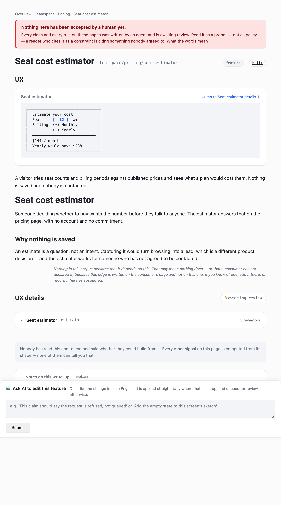
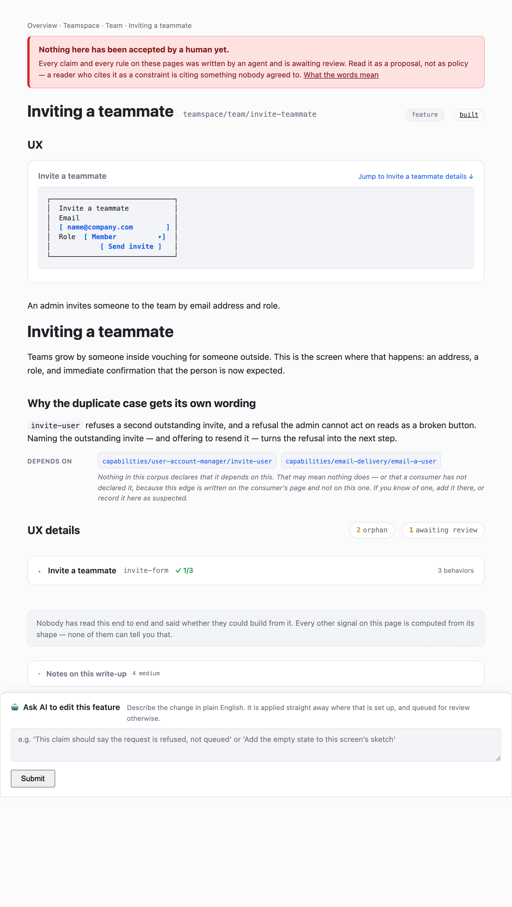
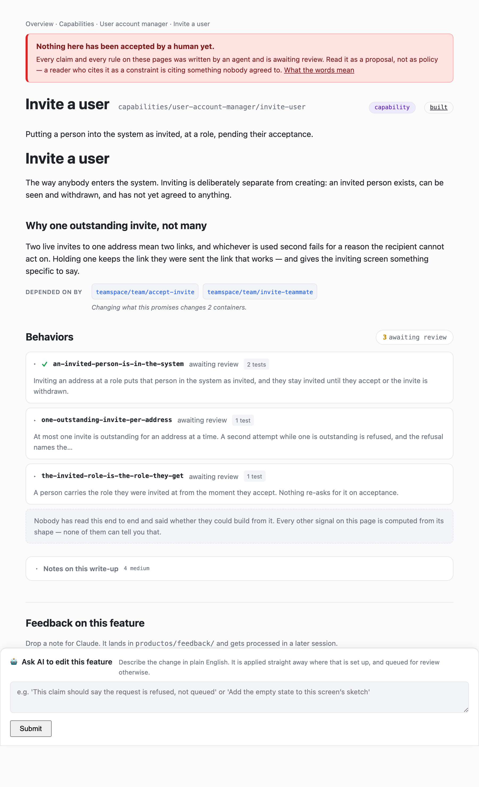
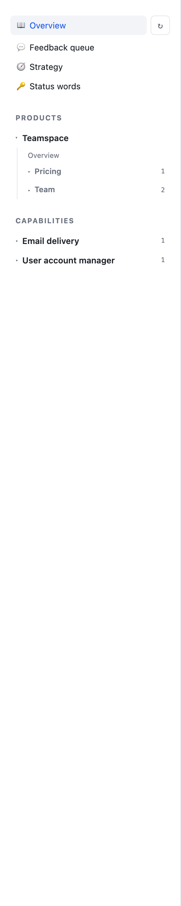
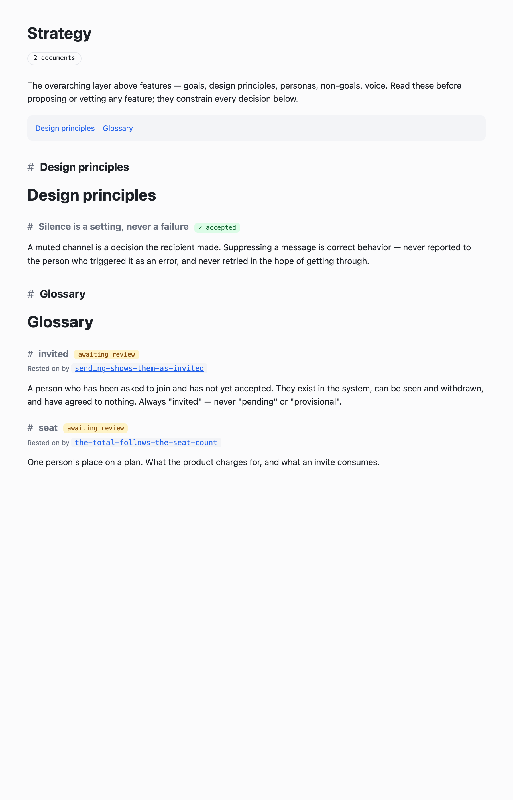
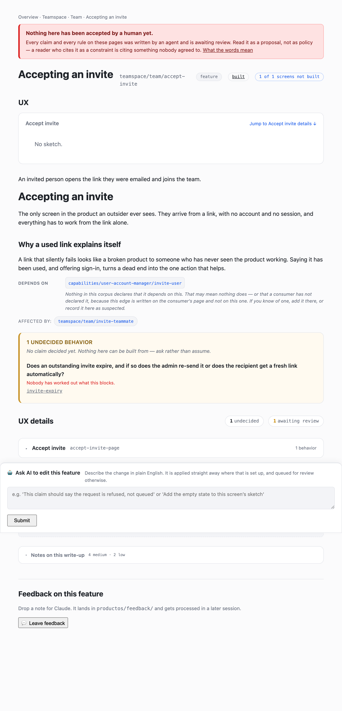
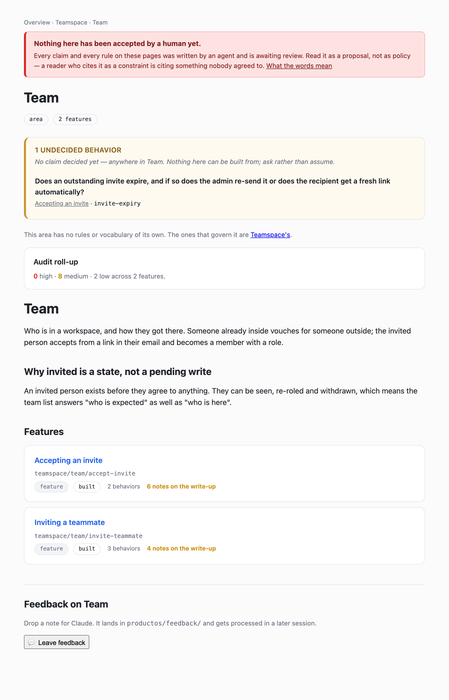

# A working example

The model as ProductOS actually renders it, built up one concept at a time on a single
product — a team tool.

[`OVERVIEW.md`](./OVERVIEW.md) introduces the model and argues why it is shaped this way.
[`GLOSSARY.md`](./GLOSSARY.md) settles what each word means. This shows what you get.

> Every picture below is a screenshot of a **real corpus**, in `docs/example/`. Nothing
> here is a mockup — run `./docs/example/regen.sh` to rebuild the images from the corpus,
> which is why they cannot drift from what the tool does.

---

## Level 1 — one feature

Some features are self-contained: the user acts, sees a result, and nothing leaves the
screen. A seat-cost estimator on the pricing page.



The page is assembled from one file. Reading down it: the **sketch** of the screen with
its interactive elements picked out, the description, the prose explaining what the
thing is and why nothing is saved, then **UX details** — the screen, and the behaviors
anchored to it.

Three behaviors here: the total follows the seat count, seats cannot go below one, the
yearly saving shows only when it exists. Each is one falsifiable claim with its own
acceptance cases.

**This is complete.** Nothing goes anywhere, so there is nothing underneath it. `3
unverified` is the honest state: an author wrote them, no human has accepted them yet.

---

## Level 2 — a feature that needs the system

Now something that does leave the screen: an admin invites a teammate.



Same shape as level 1, with one line added — **Depends on**, naming the two capabilities
this screen calls. The feature is *inviting a teammate*: the form, what it refuses, and
what the admin is told. Putting the person into the system, and emailing them, are
things the **system** does.

Those live on the other tree:



`invite-user` is a **capability**, inside the `user-account-manager` **capability
system** — a subsystem. No screens, no sketch; its behaviors are what a caller may rely
on. And **Depended on by** is derived from the other side's `depends_on`, never authored
twice: change what this promises and you can see exactly what breaks.

The two trees sit side by side in the nav:



**Feature areas** group features; **capability systems** group capabilities. Same shape,
different decomposition — an area is a product concern, a capability system is
engineering's cut of the system, which is why it is never inside an area.

The areas sit inside a **product** (`Teamspace`), and they **nest as deep as the
product needs** — this one is small enough not to, but `pricing/enterprise/` would be
an ordinary area in a larger one. `productos check` says when an area has grown past
readable and which of its features it would split out; `productos move` re-files
anything, carrying its id and every reference to it.

### Read the split carefully — this is where it goes wrong

| Claim | Whose | Why |
|---|---|---|
| at most one invite outstanding per address | **capability** `invite-user` | true of the record, whoever is looking |
| the invited role is the role they get | **capability** `invite-user` | true of the person in the system |
| the admin is *told* about the outstanding invite, and offered resend | **feature** | it is what the screen does |
| the invited person appears on the team list without a reload | **feature** | it is what the admin sees |

The capability's claims say what a consumer may rely on and never how. *"Invites live in
a table with a partial unique index"* is engineering's and never appears.

> Nearly the same words at two altitudes: the feature **invite teammate** calls the
> capability **invite user** in the **user-account-manager** system.

---

## Level 3 — a rule that governs several containers

*"We never email someone who has asked us not to"* is not a fact about inviting, or
about billing, or about delivery. It sits above all of them, in Strategy:



Each `##` section is independently citable and independently accepted — per section, not
per file, because accepting a whole file would bless fifteen rules with one click. One
has been accepted here; the rest read **not accepted**, which is honest.

A behavior refers to it with one line rather than restating it:

```yaml
cites: [principles#silence-is-a-setting-never-a-failure]
```

That line is what lets the strategy page answer *which behaviors rest on this rule* —
and makes every one of them **not ready to build** while the rule is unaccepted. The
same sentence in a prose note is unparseable, and none of it works.

---

## Level 4 — the cases that actually go wrong

The invited person clicks the link in their email and lands on an acceptance page: no
auth, its own template, no component anywhere near the invite form. **Still a feature** —
a person opens it.



Two things on that page:

**The screen is declared but not walked.** `stub: true` with
`runtime: public web, unauthenticated` says *this screen is real and nobody has scoped
it.* It keeps the feature **not ready to build** — honest, since an un-walked screen has
unknown behavior — and it gives the behaviors a home so they do not drift onto a
capability.

**One thing nobody has decided** is recorded as a question, never guessed:

```yaml
- id: invite-expiry
  question: >
    Does an outstanding invite expire, and if so does the admin re-send it or does the
    recipient get a fresh link automatically?
```

That is an **undecided behavior** — a question, no claim, no test cases. It renders
above the claims, because it is what a reader must *not* assume, and it blocks the
feature from reading ready-to-build so nothing is built past it by accident.

The area page collects them across everything it holds:



### The four mistakes this shape prevents

**❌ Calling the form the feature.** Writing `invite-teammate` with only validation
behaviors — a screen that refuses bad addresses and does nothing else. The feature is
*inviting a teammate*; if nothing puts the person in the system, it is not built.

**❌ Putting a system guarantee on a screen.** *"At most one outstanding invite per
address"* is true of the record whoever is looking, so it belongs to the capability. The
screen's behavior is that the admin is *told*.

**❌ Classifying a screen as a capability** because it has no component nearby and no
auth, so it reads as system-level. *"I could not find the UI"* means the screen is
elsewhere or unscoped — never that it is a capability. Ask what triggers it.

**❌ Putting screen behavior on a capability.** A claim needing end-to-end evidence needs
a screen, so it belongs to whichever feature owns that screen. This one is refused
outright rather than advised against.

---

## Next

- [`OVERVIEW.md`](./OVERVIEW.md) — the model, and why it is shaped this way
- [`GLOSSARY.md`](./GLOSSARY.md) — what each term means, and what it refuses
- `productos init claude`, then *"scope productos on the &lt;feature&gt; flow"*
