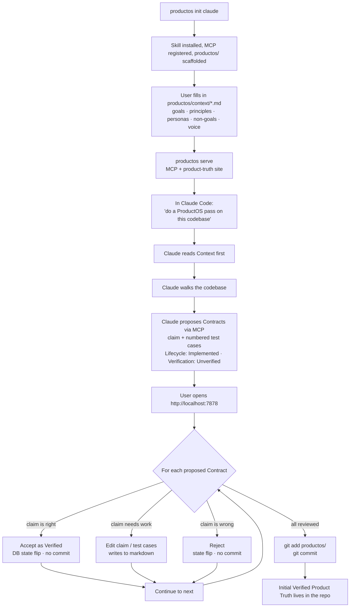
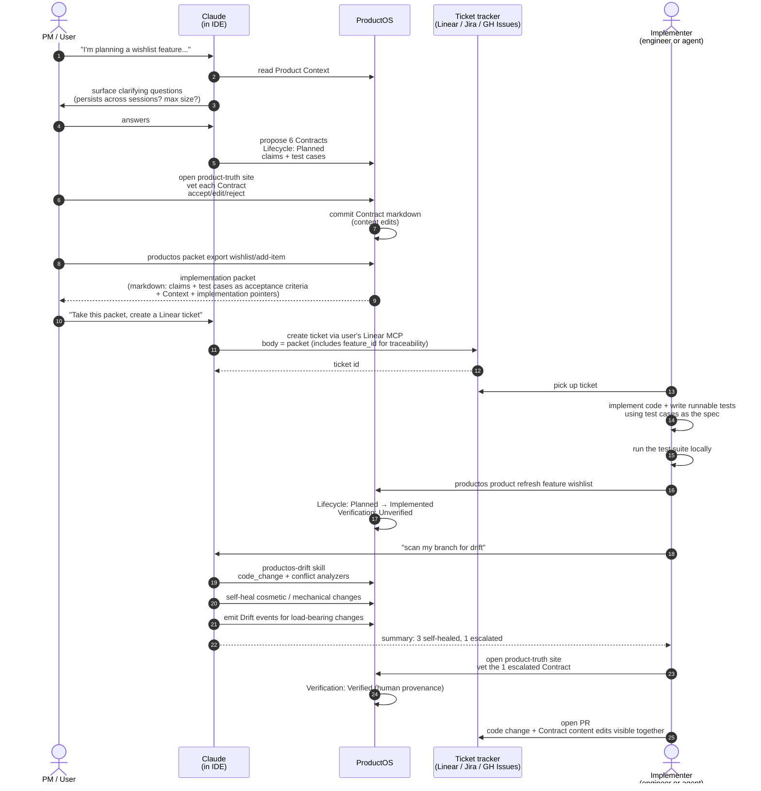

# ProductOS — Use Cases

> **Canonical conceptual reference:** [`OVERVIEW.md`](OVERVIEW.md). Personas are defined in [`VISION.md`](VISION.md). This doc walks through the three concrete flows ProductOS supports today. Everything described here is shipping behavior — no future capabilities.

## How the flows fit together

| Flow | When it runs | Primary actor |
| --- | --- | --- |
| **1. Onboarding** | Once, when a team adopts ProductOS on an existing codebase | Founder / team lead doing the setup |
| **2. Feature development** | Every new feature — idea → packet → implementation → verified Truth | PM (planning), Engineer or AI Agent (implementation) |
| **3. Test result ingestion** | Every CI run — how the user's test results feed back into ProductOS's view of Truth | The user's CI |

Onboarding produces the initial Verified corpus. Feature development is the everyday loop that grows the corpus. Test result ingestion is the live link that lets a test pass or fail in the user's CI move the Contract's Verification state without anyone touching the product-truth site.

---

## Flow 1 — Onboarding

A team adopts ProductOS on their existing codebase. They install the skill, fill in Product Context, run a first analyzer pass, vet what Claude proposes, and commit the result. Outcome: a Verified Product Truth they can hand to any AI runtime as context.



**What ships at the end of onboarding:**

- `productos/context/*.md` — durable product framing (committed)
- `productos/products/<area>/<feature>.md` — vetted Contracts with claims + numbered test cases (committed)
- Per-Contract Verification state recorded in the local DB (gitignored)

**Time budget for a medium codebase:** 30-45 minutes of HITL vetting after Context is filled in.

---

## Flow 2 — Feature development

The everyday loop. A feature idea travels through clarification (Contracts), handoff (implementation packet), execution (code + tests), drift check (pre-PR), and re-verification.



**What ships at the end of each feature cycle:**

- New Contracts with Lifecycle = `Implemented` and Verification = `Verified`
- The Contract content (claims, test cases, notes) reflects what shipped
- A trail of `human` and `self-heal:*` Verifications in the local DB
- The ticket body carries the packet (with the feature_id embedded) so anyone reading the ticket can find the Contract

**Drift outside this flow:** the Contracts produced here become the baseline for the *next* PR's drift scan. The drift loop is what keeps Truth honest as code evolves.

---

## Flow 3 — Test result ingestion

How runnable tests in the user's CI feed back into ProductOS's view of Truth. ProductOS doesn't run tests, doesn't parse test source, and doesn't own the runner. It exposes one tiny **receive** interface that takes per-test status + timestamp. Anything that can hit the interface with the right payload — a CI shell step, a GitHub Action, a Jest reporter, a pytest plugin — works. Connectors are convenience packaging around the same receive call.

```mermaid
flowchart LR
    subgraph PO[ProductOS — the spec]
        TC[Contracts with numbered test cases<br/>each carries stable id:<br/>area/feature#behavior/case]
    end

    subgraph IMPL[Implementer]
        I[reads test cases<br/>writes runnable tests<br/>encodes stable id in test name/annotation]
    end

    subgraph REPO[User's repo]
        T[describe/it blocks in jest, pytest, etc.<br/>test names carry the stable id]
    end

    subgraph CI[User's CI — unchanged]
        RUN[Runner produces per-test results]
        POST[Post-step posts results to ProductOS<br/>via CLI / HTTP / MCP / connector]
    end

    subgraph RECV[ProductOS — receive only]
        ING[Receive {stable_id, status, timestamp}<br/>Match stable id → test case<br/>Unmapped results: ignored silently]
        DRIFT[Open test_failed drift on fail<br/>Resolve on subsequent pass]
        VST[Verification recomputed:<br/>no open drift = Verified<br/>any open drift = Contested]
    end

    TC --> I
    I --> T
    T --> RUN
    RUN --> POST
    POST --> ING
    ING --> DRIFT
    DRIFT --> VST
```

**The contract with the user's stack:**

- **One tiny receive interface.** ProductOS accepts a list of `{stable_id, status, timestamp}` tuples (with optional `message` / `run_id` for context). Same payload across MCP, CLI (`productos test record < results.json`), and HTTP. No parsing of framework-specific outputs in ProductOS itself.
- **Connectors are optional convenience.** A jest reporter, pytest plugin, or JUnit-XML converter can wrap the call so the user doesn't write glue. None are required — anything that emits the payload works. Connectors ship as separate packages on the user's normal package manager.
- **Stable id is the only convention.** Format: `<area>/<feature>#<behavior>/<test_case_id>` — e.g. `auth/signup#duplicate-email/1`. The implementer puts it where their framework carries it through to the result (test name is the easiest path; some frameworks support tags or metadata).
- **Unmapped results are dropped silently.** Tests that don't carry a recognizable stable id are outside the Contract grid and don't drive Verification. No errors, no warnings — they just don't show up.
- **Deprecated test cases stay in the Contract.** When a test case (or its parent behavior) is no longer load-bearing, it gets `deprecated: true` in the markdown — it is never deleted. Stable ids are immutable + append-only. Results coming in for a deprecated id are recorded in `last_run_status` for forensics but **don't open `test_failed` Drift**. If the behavior comes back, the user removes the flag and the id resumes driving Verification — no resurrection, no renumbering.

**How a pass/fail moves Truth:**

- A **fail** on an *active* test case opens a `test_failed` Drift event on the Contract. The Contract's computed Verification flips from `Verified` to `Contested`.
- A subsequent **pass** on the same test case resolves the open `test_failed` drift. If no other drift events remain open on the Contract, the computed Verification returns to `Verified`.
- A pass or fail on a *deprecated* test case is recorded but does not flip Verification (a deprecated case is not part of current Truth).
- The engineer never opens the site for this. CI runs, ProductOS receives, the Verification state reflects reality. The site is for *viewing* or for resolving the drift events that need human judgment.

**What this delivers:**

- The user's existing CI keeps doing what it does. ProductOS doesn't replace the runner, doesn't replace the reporter, doesn't depend on any specific framework.
- The stable id is the only thing crossing the boundary in both directions: implementer writes it into the test, results flow back referencing it.
- Verification is live — no separate "re-verify" step, no manual sweep. The Contract reads as Verified at any moment when nothing currently contests it.
- Connectors absorb the awkwardness of producing the payload for popular runners. They're convenience, not a requirement.

---

## How the flows reinforce each other

- **Onboarding** seeds the corpus and teaches the team what a good Contract looks like.
- **Feature development** uses the corpus as context (Claude pulls Verified Contracts during the feature pass) and grows it (new Contracts get added).
- **Test result ingestion** lets the team's existing CI move Verification state automatically — ProductOS receives status events without owning the runner or parsing framework-specific output.

The whole system is one tight loop: Context constrains what Contracts can claim → Contracts hold claims + test cases → the implementer writes code and tests against them → drift surfaces what changed (from code analysis or from the CI's test results) → humans vet only what genuinely needs judgment. Self-heal handles the rest.
